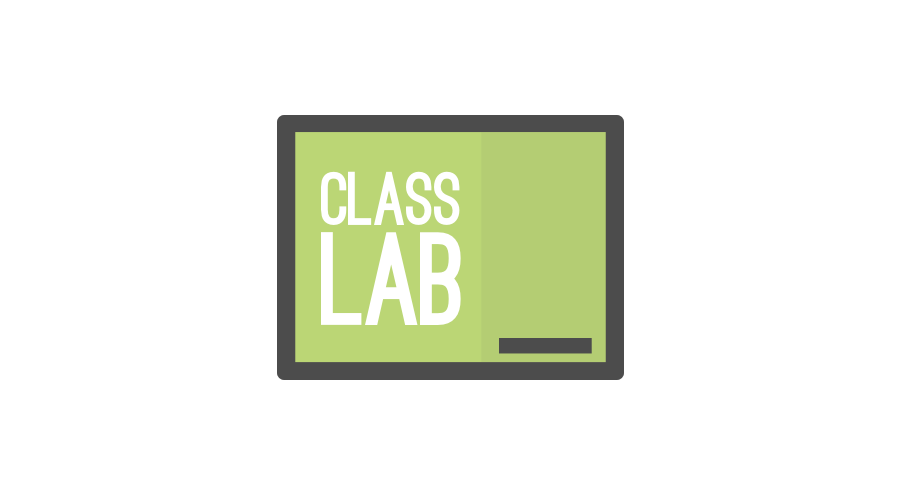

# 

Classlab is a virtual classroom for workshops.

## Installation

**Requirements**

* Elixir 1.3+
* Node 6.0+
* PostgreSQL

To start the classlab app:

  * Clone the repo with `git clone https://github.com/classlab/classlab.git`
  * Install dependencies with `mix deps.get`
  * Set up the project the first time `mix setup`
  * Install Node.js dependencies with `npm install`
  * Start the app with `mix s`

Now you can visit [`localhost:4000`](http://localhost:4000) from your browser.

## Use with docker

### Start it locally

init: `docker-compose run web mix ecto.setup`

run: `docker-compose up`

### Build the container

build: `docker build -t classlab .`

## Team

 |  | 
---|---|---
[Sascha Brink](https://github.com/sbrink) | [Martin Schurig](https://github.com/schurig) | [Bengt Weisse](https://github.com/KillerCodeMonkey)

## License

MIT © Symetics GmbH
